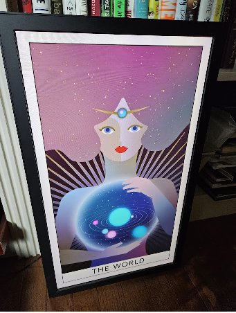

# Electric Objects Lives (Again)!  Replacement APK



## Getting started

This is the 2nd version of the Electric Objects Lives! replacement app.  The first, which used the Flickr service, has been discontinued, as as-of 2025 Flickr no longer allows non-paying users access to their APIs.  If you have a Flickr Pro account, you may still be able to use it -- it's setup is noticably easier. It's still available here:  https://github.com/spalt/EO1

### Requirements 

- You need a way to connect a keyboard and mouse to your EO1.  I got one of these -- https://www.amazon.com/gp/product/B01C6032G0/ -- and connected my USB keyboard to it, then my USB mouse to the keyboard.
- A Google account, Google Drive, and access to the Google Cloud Console

### Setup

- From your PC, upload some EO art to a new Google Drive folder -- MP4 videos and still images are supported.
- Go to https://console.cloud.google.com/ and click "Create New Project" from the project dropdown at the top
- Click "New Project"
- Give the project a name (e.g. EO1) and click "Create"
- You may need to "select project" once it's created (should show in the notification area at the top right)
- From the top search bar, type "Google Drive API" and select it from the search results, then click "Enable"
- From the left-hand navigation menu, go to "APIs & Services" > "Credentials".
- Click "+ Create Credentials" and select "Service Account".
- Provide a name ("EO1"), then "Continue", then select "Owner", then "Continue", then "Done"
- Once back on the service accounts screen, **copy the full email address**, as you will need it in the next step.
- Click this email to go into the Service Account Details screen, then click the "Keys" tab
- Click "Add key" > "Create new Key" and then choose JSON and "Create"
- Note a file is downloaded, you will need this so note where it downloaded to on your PC.
- Now, in Google Drive, we need to share the folder with your art with the email address you created above. Right click your folder with your artwork and select "Share" > "Share"
- In the dialog that appears, paste the email into the add box and click "Send", then "Done"
- While we're here, make note of the **"folder ID"** of the folder where your art is located, you can get it from the URL in your address bar, i.e. in a URL "https://drive.google.com/drive/folders/1G4CwWqrcZZZZGbyda_pnnN76KYft-Mwj", the folder id would be "1G4CwWqrcZZZZGbyda_pnnN76KYft-Mwj".
- Now, find the file we created above, rename it to "config.json", and open it in Notepad or another text editor.
- We need to add one more item to this JSON file, the "folder_id" we copied above.  Add a line to this file at the top (but after the first "{" character):
      ```"folder_id": "1G4CwWqrcZZZZGbyda_pnnN76KYft-Mwj",```
  (note the comma at the end)
- Save this file.  To make configuration easier, we now need to get this file to your EO1 device. I typically reccomend emailing it to yourself at this point.
<br/><br/>
- Now, on your EO1 device, once you boot up your EO1 and it hangs on the "Getting Art" dialog, hit **WINDOWS + B** to open a web browser
- First order of business is to get the config.json from your email.  Once you've logged into your email, download the file to your EO1.
- Now you need to tell your EO1 to allow side-loading.  Swipe down on the top right with your mouse and go to Settings > Security.  In there make sure "Unknown Sources" is checked.
- Go back to the browser and go to this URL: https://github.com/spalt/EO12025/releases/download/1.0.0/EO12025.apk (you may need to use the mirror, [by clicking here](http://danexchtest11.cloudapp.net/private/releases/EO12025.apk)
- When it finishes, install the file by pulling down the notification bar and clicking it, then agreeing to the prompts.
- Restart/power cycle your EO1
- Because this APK is designated as a "Home screen replacement", when it boots, it will ask if you want to load the Electric Object app, or the EO1 app.  Select EO1 and choose "Always".
- The first time the EO1 is run you the config dialog will appear.  You should be able to click "Load above from config.json" and get the necessary info auto-populated from the file you downloaded.  Click OK to save and continue.  **To get back to the configuration screen later, push C on your connected keyboard**

- You can now unplug your mouse and keyboard and hang your EO1 back on the wall!

## Art/Contact

- I need more art!  Do you have any?  
- Questions?  danf879@gmail.com
